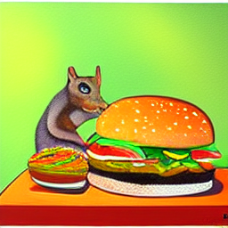
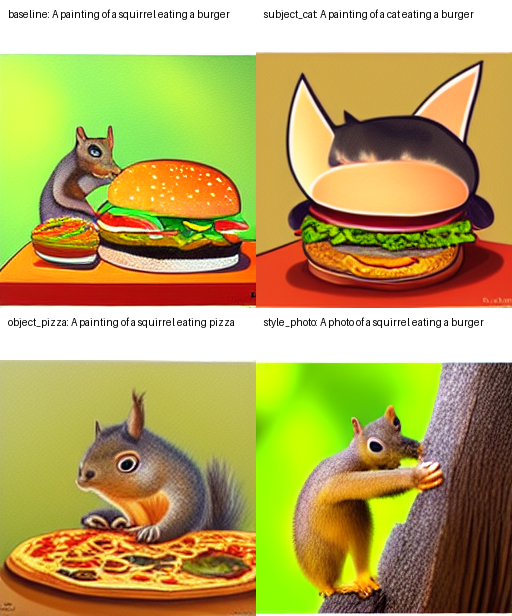

# Latent Diffusion Redo 與 Cross-Attention 機制觀察報告

## 1. 報告目標

這份報告主要回答兩個問題：

1. redo 一個可執行的 Latent Diffusion text-to-image baseline 及 比較直接在pixel space效率差異
2. cross-attention 如何讓 text prompt 影響最後生成的影像？

## 2. 背景

流程如下：

```text
Input prompt
  -> text encoder
  -> text embeddings
  -> cross-attention inside UNet
  -> denoising in latent space
  -> decoder
  -> generated image
```

相較於 pixel-space diffusion，latent-space diffusion 的計算成本比較低，因為 UNet 處理的是被壓縮後的 latent representation。以 256x256 image 為例，latent tensor 通常會小很多：

```text
image:  [1, 3, 256, 256]
latent: [1, 4, 32, 32]
```

在本次 observation 中，兩者的 scalar value 數量如下：

```text
pixel image values: 3 * 256 * 256 = 196,608
latent values:      4 * 32 * 32   = 4,096
compression ratio:  196,608 / 4,096 = 48x
```

這代表在 256x256 image setting 下，latent denoising 的主要 representation 比直接 pixel-space image tensor 少 48 倍 scalar values。這不是完整的 runtime benchmark，但可以清楚說明為什麼 latent-space diffusion 在計算上更有效率。

## 3. Latent Space 效率觀察

### 3.1 實驗目的

這個 observation 用來支持報告目標中的第一部分：redo LDM baseline，並說明 latent-space diffusion 相較於直接在 pixel space 做 diffusion 的效率差異。

### 3.2 實驗結果

結果已保存於：

```text
outputs/experiments/001_latent_efficiency_observation/metadata/latent_vs_pixel_shape.json
outputs/experiments/001_latent_efficiency_observation/logs/run.log
```

記錄結果如下：

```text
image_shape: [1, 3, 256, 256]
latent_shape: [1, 4, 32, 32]
pixel_values: 196608
latent_values: 4096
compression_ratio_pixel_over_latent: 48.0
```

這個結果表示：如果直接在 pixel space 表示一張 256x256 RGB image，需要 196,608 個 scalar values；而 LDM 在 latent space 中使用 `[1, 4, 32, 32]`，只需要 4,096 個 scalar values。也就是說，latent representation 在數量上比 pixel representation 小 48 倍。

### 3.3 解讀

這個觀察說明了 LDM 的效率來源之一：UNet 不需要直接處理完整 pixel image，而是在 compact latent representation 上進行 denoising。雖然實際速度還會受到 UNet 架構、attention layers、scheduler steps 和硬體影響，但 representation size 的差異已經能提供一個清楚的效率直覺。

## 4. Redo 策略

原始 repository 的 `scripts/txt2img.py` 預期 checkpoint 放在：

```text
models/ldm/text2img-large/model.ckpt
```

但是 README 中提供的 checkpoint URL 目前會回傳 404。因此本次實驗改用 Hugging Face 上官方釋出的 diffusers 版本：

```text
CompVis/ldm-text2im-large-256
```

這裡需要特別說明：本次 baseline 不是直接執行原 repository 的 `scripts/txt2img.py`，而是使用官方 diffusers 格式權重建立一條可重現的 baseline。報告中會清楚註記這個差異，避免把它誤寫成原始 `.ckpt` 路線的完整重現。

### 4.1 為什麼本實驗使用 BERT 而不是 CLIP

本實驗使用 `BertTokenizer` 與 `LDMBertModel` 並不是任意改動原 repository 的 text encoder。原因是：原始 README 指向的 text-to-image `.ckpt` checkpoint 目前無法下載，因此本次 redo baseline 改用官方 Hugging Face diffusers 版本 `CompVis/ldm-text2im-large-256`。這個 Hugging Face model 的 architecture 本身就是使用 `BertTokenizer` 將 prompt 轉成 token ids，再由 `LDMBertModel` 產生 text embeddings。

因此，本次 cross-attention shape observation 觀察到的文字條件流程是：

```text
prompt string
  -> BertTokenizer
  -> token ids: [1, 77]
  -> LDMBertModel
  -> text embeddings: [1, 77, 1280]
  -> UNet cross-attention keys / values
```

原 repository 中確實也包含 CLIP-related encoder modules，例如 `FrozenCLIPTextEmbedder` 與 `FrozenClipImageEmbedder`。不過這些模組對應的是其他 conditioning setup，例如 retrieval-augmented diffusion 或 CLIP embedding-based variants。若在本實驗中任意把 text encoder 換成 CLIP，會改變 pretrained UNet 原本接受的 conditioning distribution，導致 baseline 不再對應目前使用的官方 Hugging Face model。

因此，本實驗保留 Hugging Face model 原本的 BERT text conditioning pipeline；這是由 pretrained model architecture 決定，而不是在 redo 過程中任意替換。

## 5. 實驗環境

本次實驗環境如下：

```text
uv virtual environment
Python 3.11.14
PyTorch 2.4.1+cu121
torchvision 0.19.1+cu121
CUDA available: True
GPU: NVIDIA GeForce RTX 2070 SUPER
pytorch-lightning 1.4.2
diffusers 0.30.3
transformers 4.36.2
```

Hugging Face model cache 放在專案內：

```text
models/huggingface
```

讓模型權重和實驗輸出分類清楚，不會混到使用者全域 cache 裡。

## 6. Baseline Redo 實驗

### 6.1 實驗目的

baseline 實驗的目的，是確認 Latent Diffusion text-to-image model 可以根據 prompt 生成語意一致的圖片。

### 6.2 Baseline Prompt

```text
A painting of a squirrel eating a burger
```

### 6.3 Baseline 設定

```text
model: CompVis/ldm-text2im-large-256
seed: 23
num_inference_steps: 50
eta: 0.3
guidance_scale: 6.0
dtype: float16
device: cuda
output size: 256x256
```

### 6.4 預期輸出

生成結果應該要包含 prompt 中的三個主要概念：

1. squirrel-like subject
2. burger-like object
3. painting-like visual style

如果模型能產生一張看起來像「squirrel eating a burger」且具有 painting style 的圖片，就可以作為 baseline redo 成功的初步證據。

### 6.5 實際結果

本次 baseline 已成功執行，輸出圖片放在：

```text
outputs/experiments/001_diffusers_text2img_baseline/images/baseline.png
```

對應 metadata 與 log 放在：

```text
outputs/experiments/001_diffusers_text2img_baseline/metadata/generation_config.json
outputs/experiments/001_diffusers_text2img_baseline/metadata/environment.json
outputs/experiments/001_diffusers_text2img_baseline/logs/run.log
```

本次執行資訊如下：

```text
experiment: 001_diffusers_text2img_baseline
prompt: A painting of a squirrel eating a burger
model: CompVis/ldm-text2im-large-256
seed: 23
num_inference_steps: 50
eta: 0.3
guidance_scale: 6.0
device: cuda
elapsed_seconds: 109.83
```

報告中插入圖片：

```markdown

```


### 6.6 Baseline 觀察

這張 baseline image 是本次 redo 的第一個有效結果。它確認了目前的 `uv + Python 3.11 + diffusers` 環境可以成功載入官方 LDM text-to-image pipeline，並完成 50-step denoising，輸出一張 256x256 image。

從實驗流程來看，這代表以下部分都已經成功串接：

```text
prompt
  -> tokenizer / text encoder
  -> text embeddings
  -> latent denoising pipeline
  -> VQ-VAE decoder
  -> generated image
```

因此，這個 baseline 可以作為後續 prompt ablation 與 cross-attention mechanism observation 的基準圖。


## 7. Cross-Attention 機制

### 7.1 直覺說明

在 text-to-image Latent Diffusion 中，UNet 需要對 noisy latent tensor 做 denoising。text prompt 不是直接變成圖片，而是先被 text encoder 轉成 text embeddings，然後透過 cross-attention 進入 UNet。

cross-attention 的關鍵是：

```text
Queries come from image latent features.
Keys and values come from text embeddings.
```

換句話說，image feature 的每個 spatial location 會去問：

```text
我現在這個位置應該參考 prompt 裡的哪些 token？
```

例如 prompt 是：

```text
A painting of a squirrel eating a burger
```

那麼在 denoising 過程中，不同 spatial region 可能會對 `squirrel`、`burger`、`painting` 等 token 有不同程度的 attention。

### 7.2 Cross-Attention 公式

給定 image features 和 text embeddings：

```text
Q = Wq * image_features
K = Wk * text_embeddings
V = Wv * text embeddings
```

attention output 為：

```text
Attention(Q, K, V) = softmax(QK^T / sqrt(d)) V
```

因此，image feature 會根據 text token 的相關性被更新。這就是 text prompt 能影響 image generation 的主要機制之一。

### 7.3 Tensor Shapes

cross-attention 的資料流可以整理成下表：

| Stage | Example Shape | Meaning |
|---|---:|---|
| Prompt | string | Input text |
| Token IDs | `[1, 77]` | Tokenized prompt |
| Text embeddings | `[1, 77, D]` | 每個 token 的語意向量 |
| Noisy latent | `[1, 4, 32, 32]` | Latent representation |
| UNet feature | `[1, C, H, W]` | UNet 中間 image feature |
| Query | `[1, heads, H*W, d]` | 由 image feature 產生 |
| Key | `[1, heads, 77, d]` | 由 text embeddings 產生 |
| Value | `[1, heads, 77, d]` | 由 text embeddings 產生 |
| Attention map | `[1, heads, H*W, 77]` | spatial-token relevance |

最重要的是 attention map 的形狀：

```text
attention map: [batch, heads, spatial_positions, text_tokens]
```

這代表 image 的每個 spatial position 都可以對 prompt 中的每個 token 分配不同的 attention weight。

## 8. Cross-Attention 機制觀察實驗

### 8.1 實驗目的

這個實驗的目標是觀察：當 prompt 裡的某些 token 被替換時，生成結果是否跟著發生對應變化。

如果固定 seed 和 sampling parameters，只改 prompt 裡的 subject、object 或 style，而生成圖片也跟著改變，就可以說明 text tokens 確實控制了生成內容。

實驗分成兩個部分：

1. 用 controlled prompt changes 產生對照圖片。
2. 紀錄 cross-attention 相關的 tensor shapes，必要時進一步抽出 selected token 的 attention maps。

### 8.2 Prompt Ablation 設計

baseline prompt：

```text
A painting of a squirrel eating a burger
```

controlled variations：

| Experiment | Prompt | Changed Concept |
|---|---|---|
| Baseline | `A painting of a squirrel eating a burger` | none |
| Subject change | `A painting of a cat eating a burger` | squirrel -> cat |
| Object change | `A painting of a squirrel eating pizza` | burger -> pizza |
| Style change | `A photo of a squirrel eating a burger` | painting -> photo |

所有實驗固定相同參數：

```text
seed: 23
num_inference_steps: 50
eta: 0.3
guidance_scale: 6.0
dtype: float16
device: cuda
```

### 8.3 預期觀察

預期結果如下：

| Prompt Change | Expected Image Change |
|---|---|
| `squirrel -> cat` | 主體從 squirrel-like 變成 cat-like |
| `burger -> pizza` | 食物物件從 burger-like 變成 pizza-like |
| `painting -> photo` | 視覺風格變得比較 photographic |

如果在 seed 和 sampling parameters 固定的情況下，這些 prompt changes 仍然造成明顯的圖像差異，就可以用來支持：

```text
prompt tokens affect generated content through the conditioning pathway.
```

### 8.4 實際結果

本次 prompt ablation 已成功執行，輸出圖片放在：

```text
outputs/experiments/002_cross_attention_mechanism/images/baseline.png
outputs/experiments/002_cross_attention_mechanism/images/subject_cat.png
outputs/experiments/002_cross_attention_mechanism/images/object_pizza.png
outputs/experiments/002_cross_attention_mechanism/images/style_photo.png
outputs/experiments/002_cross_attention_mechanism/images/comparison_grid.png
```

對應 metadata 與 log 放在：

```text
outputs/experiments/002_cross_attention_mechanism/metadata/prompts.json
outputs/experiments/002_cross_attention_mechanism/metadata/generation_config.json
outputs/experiments/002_cross_attention_mechanism/metadata/environment.json
outputs/experiments/002_cross_attention_mechanism/logs/run.log
```

本次執行資訊如下：

```text
experiment: 002_cross_attention_mechanism
model: CompVis/ldm-text2im-large-256
seed: 23
num_inference_steps: 50
eta: 0.3
guidance_scale: 6.0
device: cuda
elapsed_seconds: 36.09
```

報告中插入 comparison grid：

```markdown

```


### 8.5 Prompt Ablation 觀察

這組實驗固定 `seed`、`num_inference_steps`、`eta` 和 `guidance_scale`，只改 prompt 中的部分 token。因為 sampling 設定相同，生成結果的差異主要可以歸因於 text condition 的改變。

觀察重點如下：

| Comparison | Prompt Change | Observation Goal |
|---|---|---|
| baseline vs subject_cat | `squirrel -> cat` | 觀察主要 subject 是否跟著改變 |
| baseline vs object_pizza | `burger -> pizza` | 觀察食物 object 是否跟著改變 |
| baseline vs style_photo | `painting -> photo` | 觀察整體 style 是否從 painting-like 往 photo-like 改變 |

這個結果可以作為 cross-attention 機制的外部佐證：prompt token 被替換後，text embeddings 改變，UNet 中 cross-attention 接收到的 keys/values 也改變，因此 latent denoising trajectory 會受到不同文字條件影響，最後生成不同內容或風格的 image。

這裡還不是直接觀察 attention map，而是先用 prompt ablation 證明 text condition 的效果確實反映在輸出圖片上。下一步才會進一步觀察 cross-attention 的 tensor shapes 或 selected token attention maps。

## 9. Attention Shape 觀察

### 9.1 實驗目的

prompt ablation 可以觀察 text conditioning 的外部效果；attention shape observation 則用來說明內部機制。

這一步要記錄：

```text
token ids
decoded tokens
text embedding shape
latent shape
cross-attention query shape
cross-attention key/value shape
attention probability shape
```

### 9.2 報告用的簡化程式片段

報告中可以放一段簡化版 cross-attention computation，讓讀者知道 attention 的核心運算：

```python
import math
import torch

def cross_attention(q, k, v):
    scale = 1.0 / math.sqrt(q.shape[-1])
    attention_scores = torch.matmul(q, k.transpose(-1, -2)) * scale
    attention_probs = attention_scores.softmax(dim=-1)
    output = torch.matmul(attention_probs, v)
    return output, attention_probs
```

這段程式要表達的是：

```text
image queries attend to text keys and values
```

也就是 image latent feature 透過 attention weight 取得 text token 的資訊。

### 9.3 預期記錄的 Shapes

不同 layer 的實際 shape 可能不同，但紀錄形式會類似：

```text
prompt tokens: ["a", "painting", "of", "a", "squirrel", "eating", "a", "burger"]
latent shape: [1, 4, 32, 32]
text embedding shape: [1, 77, D]
query shape: [1, heads, spatial_positions, d]
key shape: [1, heads, 77, d]
value shape: [1, heads, 77, d]
attention probability shape: [1, heads, spatial_positions, 77]
```

這些 shape 可以說明 cross-attention 如何把 image spatial positions 和 text tokens 對接起來。

### 9.4 實際 Shape Observation 結果

本次 Experiment 003 已成功執行，輸出檔案放在：

```text
outputs/experiments/003_attention_shape_observation/metadata/tensor_shapes.json
outputs/experiments/003_attention_shape_observation/metadata/environment.json
outputs/experiments/003_attention_shape_observation/logs/run.log
```

本次使用的 prompt 為：

```text
A painting of a squirrel eating a burger
```

實際 tokenization 結果顯示，prompt 會被 `BertTokenizer` 切成 BERT-style tokens，並 padding 到長度 77：

```text
token_ids_shape: [1, 77]
tokens_first_20: [CLS], a, painting, of, a, squirrel, eating, a, burger, [SEP], [PAD], ...
text_embedding_shape: [1, 77, 1280]
latent_shape: [1, 4, 32, 32]
```

其中 `77` 是 text token sequence length，`1280` 是本模型中 LDMBertModel 輸出的 text embedding dimension。

本次記錄了三個代表性的 cross-attention modules，其中一個 early down block 的 cross-attention shape 如下：

```text
module:
  down_blocks.0.attentions.0.transformer_blocks.0.attn2

hidden_states:          [2, 1024, 320]
encoder_hidden_states:  [2, 77, 1280]

Q linear: [2, 1024, 320] -> Q heads: [2, 8, 1024, 40]
K linear: [2, 77, 320]   -> K heads: [2, 8, 77, 40]
V linear: [2, 77, 320]   -> V heads: [2, 8, 77, 40]

attention probability shape: [2, 8, 1024, 77]
```

這裡的 shape 可以這樣解讀：

```text
2    = classifier-free guidance 下的 unconditional / conditional batch
8    = attention heads
1024 = latent spatial positions, 對應 32 * 32
77   = text token sequence length
```

因此，`[2, 8, 1024, 77]` 直接對應到 cross-attention 的核心形式：每個 latent spatial position 都會對 77 個 text tokens 計算 attention weight。

mid block 的 cross-attention 也有相同的 text-token 對應關係，但 spatial positions 更少：

```text
module:
  mid_block.attentions.0.transformer_blocks.0.attn2

hidden_states:          [2, 16, 1280]
encoder_hidden_states:  [2, 77, 1280]
attention probability:  [2, 8, 16, 77]
```

這表示在較低解析度的 latent feature 上，模型仍然透過 cross-attention 將 image feature positions 對應到 prompt tokens。

本次 observation 讓前面提到的 cross-attention 機制有了實際 tensor shape 佐證：

```text
image latent features -> queries
text embeddings       -> keys / values
attention map         -> [batch, heads, spatial_positions, text_tokens]
```

### 9.5 Token-Level Attention Map 想法

如果後續有抽出 attention maps，可以針對特定 token 做 visualization：

```text
token: squirrel
token: burger
token: painting
```

處理方式可以是：

```text
[heads, spatial_positions, tokens]
  -> average over heads
  -> select token index
  -> reshape spatial_positions to H x W
```

如此可以得到粗略 heatmap，用來觀察不同 token 影響哪些 image regions。

不過 attention map visualization 需要小心解讀。它可以幫助說明模型行為，但不能被視為完整的 causal proof。

## 10. 實際輸出分類

目前已完成的實驗輸出整理如下：

```text
outputs/experiments/
  001_diffusers_text2img_baseline/
    images/
      baseline.png
    metadata/
      environment.json
      generation_config.json
    logs/
      run.log

  001_latent_efficiency_observation/
    metadata/
      latent_vs_pixel_shape.json
    logs/
      run.log

  002_cross_attention_mechanism/
    images/
      baseline.png
      subject_cat.png
      object_pizza.png
      style_photo.png
      comparison_grid.png
    metadata/
      prompts.json
      generation_config.json
      environment.json
    logs/
      run.log

  003_attention_shape_observation/
    metadata/
      tensor_shapes.json
      environment.json
    logs/
      run.log
```

這樣可以把 generated images、metadata 和 logs 分開。後續寫報告時，可以追溯每張圖的 prompt、每次實驗的 sampling parameters，以及 cross-attention observation 的 tensor shapes。

## 11. 結論

本次實驗完成了一條可執行的 Latent Diffusion text-to-image baseline。由於原 repository README 中的 `.ckpt` checkpoint URL 目前回傳 404，無法直接使用 `scripts/txt2img.py` 重現原始路線，因此本報告改用官方 Hugging Face diffusers 權重 `CompVis/ldm-text2im-large-256` 作為替代 baseline。這個模型成功在 RTX 2070 SUPER 上完成生成，並輸出 baseline image，證明目前環境、模型權重與 generation pipeline 可以正常運作。

從效率角度來看，Latent Diffusion 的優勢來自於在 compressed latent space 中進行 denoising。對於 256x256 RGB image，pixel representation 為 `[1, 3, 256, 256]`，共有 196,608 個 scalar values；而本實驗使用的 latent representation 為 `[1, 4, 32, 32]`，只有 4,096 個 scalar values。兩者相差 48 倍。這個 observation 說明 LDM 不需要直接在完整 pixel image 上做 diffusion，而是在更 compact 的 latent representation 上進行 denoising，因此能降低主要 representation 的計算負擔。

從 text conditioning 的角度來看，prompt ablation 實驗顯示，當固定 seed、sampling steps、eta 與 guidance scale，只替換 prompt 中的 subject、object 或 style token 時，生成結果也會出現對應變化。這說明 text prompt 並不是只作為表面輸入，而是會實際影響 denoising trajectory，進而改變最後生成的 image content 與 style。

最後，cross-attention shape observation 提供了模型內部機制的 tensor-level 佐證。本次實驗觀察到 prompt 會先經過 `BertTokenizer` 與 `LDMBertModel`，形成 `[1, 77, 1280]` 的 text embeddings。進入 UNet cross-attention 時，代表性的 attention module 具有以下形式：

```text
Q heads: [2, 8, 1024, 40]
K heads: [2, 8, 77, 40]
V heads: [2, 8, 77, 40]
attention probability shape: [2, 8, 1024, 77]
```

其中 `1024 = 32 * 32`，代表 latent spatial positions；`77` 是 text token sequence length；`8` 是 attention heads；`2` 則來自 classifier-free guidance 中的 unconditional / conditional batch。這個 shape 直接對應到 cross-attention 的核心概念：image latent positions 作為 queries，text embeddings 作為 keys 與 values，使每個 latent spatial position 都能 attend 到 prompt tokens。

因此，本次實驗可以支持以下結論：

1. Latent Diffusion 有效，是因為它在 compact latent space 中進行 denoising，同時仍能生成符合 prompt 的 image。
2. 相較於直接在 pixel space 表示 256x256 RGB image，latent representation 在 scalar value 數量上小 48 倍，提供了效率上的直覺解釋。
3. Prompt ablation 顯示 text tokens 的改變會反映在生成結果上，表示 text conditioning 確實影響 generation process。
4. Cross-attention 的實際 tensor shapes 顯示 image latent features 會 attend to text tokens，這提供了 text prompt 影響 image generation 的內部機制佐證。

## 12. 限制

本次實驗沒有直接使用原 repository 的 `scripts/txt2img.py`，因為原始 checkpoint URL 目前回傳 404。因此，本次實驗使用官方 Hugging Face diffusers version 作為替代 baseline。

prompt ablation 提供的是 qualitative evidence，而不是 quantitative evaluation。本次沒有計算 FID、CLIP score 或 human preference scores。

如果後續抽取 attention maps，也需要謹慎解釋。attention visualization 可以輔助理解模型行為，但不代表能完整證明每個視覺元素的生成原因。
